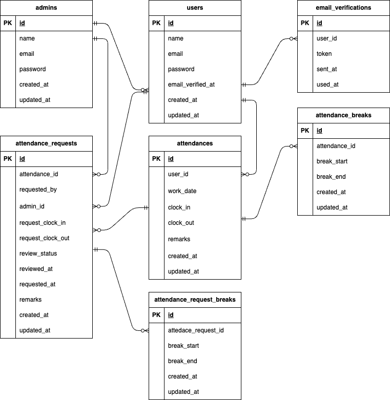

# 模擬案件_勤怠管理アプリ

## 環境構築

## Dockerビルド

```
git clone https://github.com/sekirubeg/am-mogi.git
docker-compose up -d --build
```

※MySQL は OS によって起動しない場合があります。必要に応じて docker-compose.yml を各自の環境に合わせて編集してください。

## Laravel 環境構築

```
docker-compose exec php bash
composer install
cp .env.example .env
php artisan key:generate
php artisan migrate
php artisan db:seed
```

## 使用技術
```
PHP 7.4.9
Laravel 8.83.8
MySQL 8.0.40
```
## URL
```
開発環境: http://localhost/
phpMyAdmin: http://localhost:8080/
```
## ER図
